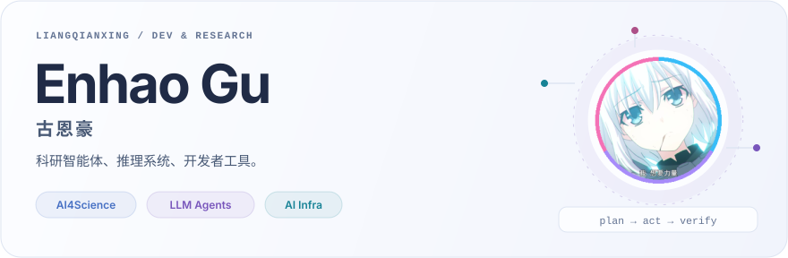
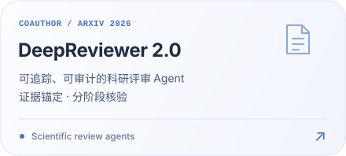
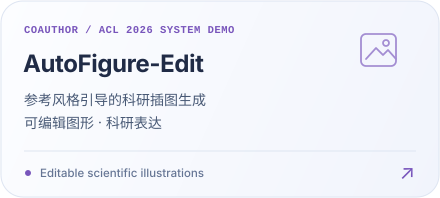
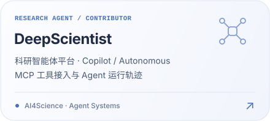
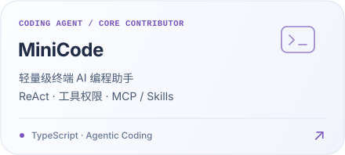
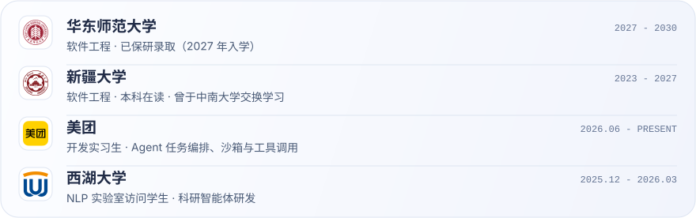

<picture>
  <source media="(max-width: 960px) and (prefers-color-scheme: dark)" srcset="assets/profile-header-mobile-dark.svg" />
  <source media="(max-width: 960px) and (prefers-color-scheme: light)" srcset="assets/profile-header-mobile-light.svg" />
  <source media="(prefers-color-scheme: dark)" srcset="assets/profile-header-dark.svg" />
  
</picture>

  <a href="https://liangqianxing.github.io"><b>Blog ↗</b></a>
  &nbsp; · &nbsp;
  <a href="https://github.com/ResearAI/DeepScientist"><b>DeepScientist ↗</b></a>
  &nbsp; · &nbsp;
  <a href="https://github.com/liangqianxing?tab=repositories"><b>Projects ↗</b></a>

你好，我是 **古恩豪 / Enhao Gu**。我做科研智能体与软件开发，近期关注 Agent 记忆、上下文管理和推理效率，也把实验与工程笔记整理在 [个人网站](https://liangqianxing.github.io)。

<picture><source media="(prefers-color-scheme: dark)" srcset="assets/profile-status-location-dark.svg" /></picture>
<picture><source media="(prefers-color-scheme: dark)" srcset="assets/profile-status-meituan-dark.svg" /></picture>
<picture><source media="(prefers-color-scheme: dark)" srcset="assets/profile-status-education-dark.svg" /></picture>

### 01 / Research · 科研工作

<a href="https://arxiv.org/abs/2604.09590"><picture><source media="(max-width: 600px) and (prefers-color-scheme: dark)" srcset="assets/research-deepreviewer-mobile-dark.svg" /><source media="(max-width: 600px) and (prefers-color-scheme: light)" srcset="assets/research-deepreviewer-mobile-light.svg" /><source media="(prefers-color-scheme: dark)" srcset="assets/research-deepreviewer-dark.svg" /></picture></a>
<a href="https://aclanthology.org/2026.acl-demo.6/"><picture><source media="(max-width: 600px) and (prefers-color-scheme: dark)" srcset="assets/research-autofigure-mobile-dark.svg" /><source media="(max-width: 600px) and (prefers-color-scheme: light)" srcset="assets/research-autofigure-mobile-light.svg" /><source media="(prefers-color-scheme: dark)" srcset="assets/research-autofigure-dark.svg" /></picture></a>

### 02 / Projects · 我在做的东西

<a href="https://github.com/ResearAI/DeepScientist"><picture><source media="(max-width: 600px) and (prefers-color-scheme: dark)" srcset="assets/project-deepscientist-mobile-dark.svg" /><source media="(max-width: 600px) and (prefers-color-scheme: light)" srcset="assets/project-deepscientist-mobile-light.svg" /><source media="(prefers-color-scheme: dark)" srcset="assets/project-deepscientist-dark.svg" /></picture></a>
<a href="https://github.com/LiuMengxuan04/MiniCode"><picture><source media="(max-width: 600px) and (prefers-color-scheme: dark)" srcset="assets/project-minicode-mobile-dark.svg" /><source media="(max-width: 600px) and (prefers-color-scheme: light)" srcset="assets/project-minicode-mobile-light.svg" /><source media="(prefers-color-scheme: dark)" srcset="assets/project-minicode-dark.svg" /></picture></a>

[DeepScientist 官网 ↗](https://deepscientist.cc)

### 03 / Journey · 教育与经历

<picture>
  <source media="(max-width: 960px) and (prefers-color-scheme: dark)" srcset="assets/journey-mobile-dark-0add2de065.svg" />
  <source media="(max-width: 960px) and (prefers-color-scheme: light)" srcset="assets/journey-mobile-light-898f3a8ab5.svg" />
  <source media="(prefers-color-scheme: dark)" srcset="assets/journey-dark-5da58de2bc.svg" />
  
</picture>

  
<b>展开文字版经历</b>

   

  | 时间 | 经历 |
  | :--- | :--- |
  | 2027 - 2030 | **华东师范大学** · 软件工程，已保研录取，2027 年入学 |
  | 2023 - 2027 | **新疆大学** · 软件工程本科，曾于中南大学交换学习 |
  | 2026.06 - 至今 | **美团** · 开发实习生，参与 Agent 任务编排、沙箱与工具调用链路 |
  | 2025.12 - 2026.03 | **西湖大学 NLP 实验室** · 访问学生，参与科研智能体研发 |

### 04 / Toolkit · 常用工具

<b>Agent / AI</b> 
<picture><source media="(prefers-color-scheme: dark)" srcset="assets/tool-badges/python-dark.svg" /></picture>
<picture><source media="(prefers-color-scheme: dark)" srcset="assets/tool-badges/pytorch-dark.svg" /></picture>
<picture><source media="(prefers-color-scheme: dark)" srcset="assets/tool-badges/transformers-dark.svg" /></picture>
<picture><source media="(prefers-color-scheme: dark)" srcset="assets/tool-badges/react-loop-dark.svg" /></picture>
<picture><source media="(prefers-color-scheme: dark)" srcset="assets/tool-badges/mcp-dark.svg" /></picture>
<picture><source media="(prefers-color-scheme: dark)" srcset="assets/tool-badges/context-dark.svg" /></picture>

<b>Engineering</b> 
<picture><source media="(prefers-color-scheme: dark)" srcset="assets/tool-badges/typescript-dark.svg" /></picture>
<picture><source media="(prefers-color-scheme: dark)" srcset="assets/tool-badges/react-vue-dark.svg" /></picture>
<picture><source media="(prefers-color-scheme: dark)" srcset="assets/tool-badges/nuxt-dark.svg" /></picture>
<picture><source media="(prefers-color-scheme: dark)" srcset="assets/tool-badges/fastapi-dark.svg" /></picture>
<picture><source media="(prefers-color-scheme: dark)" srcset="assets/tool-badges/cplusplus-cuda-dark.svg" /></picture>
<picture><source media="(prefers-color-scheme: dark)" srcset="assets/tool-badges/docker-linux-dark.svg" /></picture>

  
<b>竞赛与 GitHub 活动</b>

   
  
ACM-ICPC 亚洲区域赛铜牌、全国邀请赛银牌、新疆自治区赛金牌；CCPC 全国邀请赛银牌。

  <picture>
    <source media="(prefers-color-scheme: dark)" srcset="https://raw.githubusercontent.com/liangqianxing/liangqianxing/output/github-stats-dark.svg" />
    
  </picture>
  <picture>
    <source media="(prefers-color-scheme: dark)" srcset="https://raw.githubusercontent.com/liangqianxing/liangqianxing/output/top-languages-dark.svg" />
    
  </picture>
    
  <picture>
    <source media="(prefers-color-scheme: dark)" srcset="https://raw.githubusercontent.com/liangqianxing/liangqianxing/output/github-contribution-grid-snake-dark.svg" />
    
  </picture>

  <b>Research agents · Inference systems · Developer tools</b> 
  欢迎交流科研智能体、推理系统与开发者工具。

